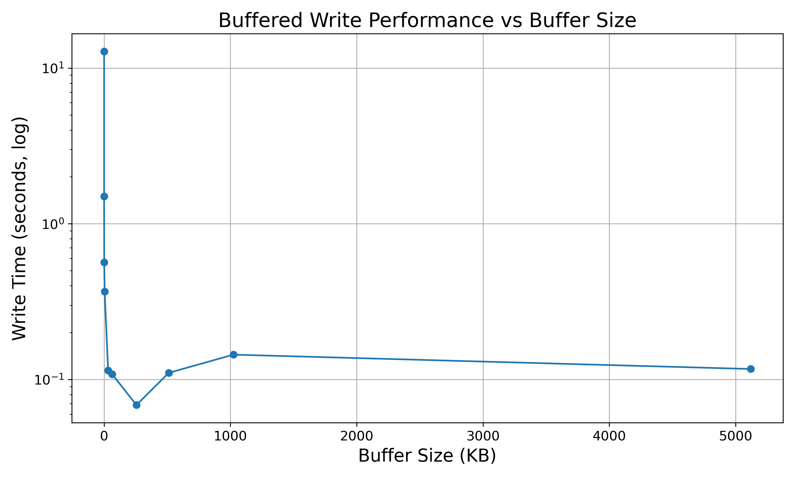

# Buffer Benchmarking

For large files, it is more efficient to buffer large chunks of the file as opposed to read it line by line becuase I/O read-write operations to the SDD are expensive (even more expensive if it is a HDD).

But how big of a buffer do you need? The default 64kB seems arbitrary. 

Well it depends a lot on the specifics, but this is a quick example to test different approaches. Although this module is written in `go` I also intend to benchmark it with a `python` version as well.

## Running the Benchmarks

Just the `main.go` file normally: `go run main.go`. By default, the program uses a 5 million line file for testing.

You can change this in the `const` declaration at the top of `main.go`.

If you want to experiment with other types of files see instructions below for generating more complex data.

A `.csv` file will be generated with the results. Here is a simple plot of the results run on an M1 Macbook Air:



## Generating Other Data

To generate a large file to test this on use the following command on Unix platforms:

> [!Warning]
> This will create a one million line `.csv` file that takes up about 320MB of disk space

```
seq 1 1000000 | awk '{print $1 "," $1*rand() "," $1*rand()}' >> big_file.csv
```


